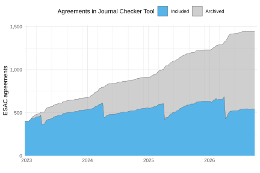

## Weekly Transformative Agreement Data dumps

This repo contains weekly dumps of [public transformative agreement data](https://journalcheckertool.org/transformative-agreements/) as provided by the [Journal Checker Tool](https://journalcheckertool.org/) from the [cOAlition S](https://www.coalition-s.org/). 


```{r, echo=FALSE, message=FALSE, warning=FALSE}
# Creates jct_development.svg and my_jct_df
source("jct_stats.R", local = knitr::knit_global())

latest <- my_jct_df |>
  filter(time == max(time)) |>
  select(name, value) |>
  tidyr::pivot_wider()
```



As of `r as.Date(max(my_jct_df$time))`, `r format(latest$active, big.mark = ",")` agreements are currently included in the Journal Checker Tool, and `r format(latest$vanished, big.mark = ",")` archived agreements are safeguarded in this repo (`r format(latest$active + latest$vanished, big.mark = ",")` in total).

## Data

Data are stored in the `data/` folder, comprising two files

- `data/jct_journals.csv`: complete dump of journals metadata associated with transformative agreements
- `data/jct_institutions.csv`: complete dump of institutions metadata associated with transformative agreements

## Snapshots

```{r, results='asis', message=FALSE, echo=FALSE}
library(dplyr)
library(lubridate)
library(knitr)

git_log <- readr::read_tsv("log.txt", col_names = FALSE)
git_log |>
  select(commit = 1, date = 2) |>
  filter(lubridate::wday(date) == 2 | date ==  max(date)) |>
  dplyr::mutate(link = paste0("<a href='https://github.com/njahn82/jct_data/tree/", commit, "/data'>",commit, "</a>")) |>
  select(`Time added` = date, `Commit` = link) |>
  knitr::kable()
```

```{r echo =FALSE, message=FALSE, warning=FALSE}
# Most recent data update
max_update <- git_log |>
  head(1) |>
  mutate(my_date = as_date(X2)) |>
  pull(my_date)
```

## Latest stats as on `r max_update`

```{r echo =FALSE, message=FALSE, warning=FALSE}
jct_journals <- readr::read_csv("data/jct_journals.csv")
jct_institutions <- readr::read_csv("data/jct_institutions.csv")
```

- `r length(unique(jct_journals$esac_id))` transformative agreements with ESAC ID
- `r format(length(unique(jct_journals$journal_name)), big.mark=",")` journal titles covered
- `r format(length(unique(jct_institutions$inst_name)), big.mark=",")` institutions participating
- `r format(length(unique(jct_institutions$ror_id)), big.mark=",")` institutions covered have a ROR-ID

## License

CCO